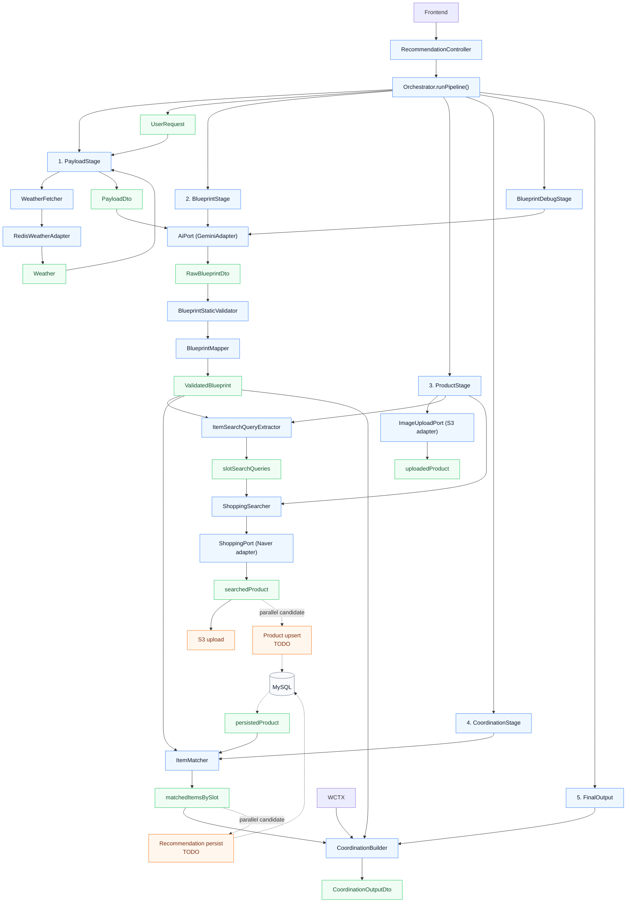

# recommendation 패키지 폴더 트리-이해가 용이하게 만들었습니다.

## enum, dto만 완성했고 비즈니스 로직을 담당하는 service는 뼈대만 만들었습니다.

## 용어 경계
- `Blueprint`: AI 생성/검증/중간 산출물(내부 처리용)
- `Coordination`: 최종 코디 결과(외부 응답용)
- `Recommendation`: 추천 과정 전반
- `slot`: 카테고리가 어디에 들어가야할 지 정하는 키. 
- `category`: 옷의 종류. 코트와 자켓은 같은 outer slot에 들어간다. 
- `product`: item(closet_item을 포함한) 개별 옷의 전체집합. 명시적이지는 않으나 원시 스키마 구조가 협의되었으므로 이대로 가겠습니다.
  
## Visual Tree
```
recommendation
├─ controller
├─ domain ----------- enum과 추후 ai 호출시 사용할 프롬프트 정의 레이어 입니다. 비즈니스에서 고립하기 위해 만들었습니다.
│  ├─ enums
│  └─ prompt
├─ dto
│  ├─ api ----------- 인/아웃바운드 계약 DTO
│  ├─ internal ------ 파이프라인 내부 계산/검증/계약 DTO
│  └─ persistent ---- DB 매핑용 DTO
├─ exception -------- 추후 Sentry 고도화시 통합 예정
├─ mapper
├─ config
├─ infra ------------ 외부 연동 구현체(adapter/properties)
│  ├─ gemini
│  ├─ map
│  ├─ naver
│  ├─ s3
│  └─ weather
└─ service ---------- 오케스트레이션과 도메인 서비스
   ├─ payload
   ├─ blueprint
   ├─ product
   ├─ coordination
   ├─ finaloutput
   └─ Orchestrator.java
   
```

## Main Pipeline

아래 다이어그램은 현재 recommendation의 메인 실행 흐름만 남긴 것입니다.

- `실선`은 현재 코드상 실제로 순차 실행되는 메인 파이프라인입니다.
- `점선`은 아직 구현되지 않았지만, 외부 API 호출 이후 별도 작업으로 병렬화할 수 있는 내부 저장 후보입니다.



## Transfer Notes

- `UserRequestDto`는 recommendation 파이프라인의 유일한 인바운드 루트 계약입니다.
- `UserRequest`, `Location`, `Weather`, `ImageData`는 내부 비즈니스 로직에서 재사용하는 DTO입니다.
- `PayloadDto`는 AI 어댑터로 전달하는 단일 payload 계약입니다.
- `RawBlueprintDto`는 Gemini가 반환한 원본 구조화 결과이고, `ValidatedBlueprint`는 이를 recommendation 내부 규칙에 맞게 재구성한 내부 계약입니다.
- `slotSearchQueries -> searchedProduct -> persistedProduct -> matchedItemsBySlot`이 product, coordination 단계의 메인 중간 산출물입니다.
- 검색된 상품은 곧바로 매칭에 쓰는 것이 아니라, S3/DB 업서트 이후 저장된 상품 기준으로 `ValidatedBlueprint`와 대조하는 흐름을 목표로 합니다.
- `searchedProduct` 이후의 product upsert와 `matchedItemsBySlot` 이후의 recommendation 영속화는 아직 구현되지 않았지만 병렬 분리할 여지가 있습니다.
